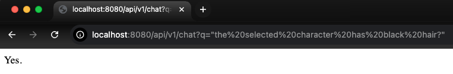
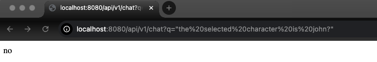
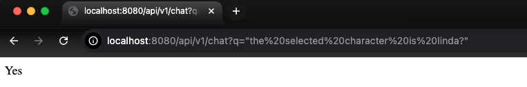

# whoswho
Demo on how easy it is to build AI-driven applications with Spring Boot and Spring AI. 
It also shows how to implement advanced techniques for the adaption of foundation models with Retrieval Augmented Generation.
This app calls a local ollama LLM to answer your whoswho game question (by yes or no) based on a [character document](https://github.com/spuchol81/whoswho/blob/main/src/main/resources/static/Cards.json) loaded at app startup.
You can change characters properties. To allow LLM to understand the character chosen, one of the character has selected json property to true, the other characters have false.

# Running the application locally
```
./mvnw spring-boot:run
```

# Ask questions with browser


